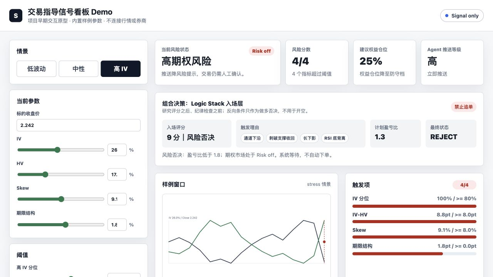
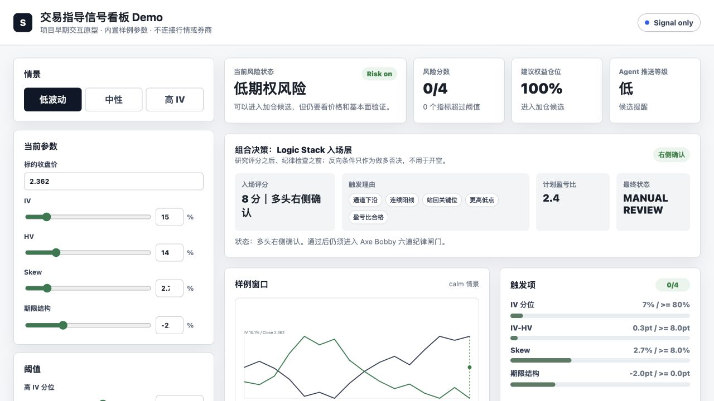

# Axe Bobby · 投研复核工作台

看好一家公司，和今天适不适合考虑入场，是两个问题。这个项目把研究证据、市场条件和风险限制拆开，最后留下一个人能复核的决定。

这里放了两个阶段的成果：一个可以调参数的早期交互沙盘，以及从原项目抽出的 Python 规则。先看页面，比较容易理解它想解决什么。



*入场条件得分不低，但 RR 只有 1.3，风险条件也没有通过，结果仍是 REJECT。页面所有数值都是内置样例。*

## 打开沙盘

```sh
python3 -m http.server 8080
```

访问 `http://localhost:8080/demo/review-sandbox.html`。可以切换高 IV、低波动情景，调整阈值，观察入场理由和否决原因怎么变。通知预览只写入页面内的模拟收件箱。



*切到低波动情景后，结果变成 MANUAL REVIEW，仍需人工复核。页面的仓位百分比是早期原型参数，不是实际配置建议。*

原来的三案例概览也保留在 [`demo/index.html`](demo/index.html)。

## Python 里保留了什么

规则按研究评分、否决项、市场状态和入场复核组织。输入直接注入，不需要行情账号。输出带着原因，方便逐项追问，而不只剩一个分数。

```sh
python3 workbench.py
python3 -m unittest discover -s tests -v
```

内置案例刻意放了几个对照：A 的研究证据可以进入候选复核；B 的评分相同，但数据过期，因此被阻断；C 触发研究否决项。高分不能绕过数据质量和否决条件。

**交互沙盘和 Python 是两个阶段的实现，不是同一套模型的前后端。** 沙盘用来试交互和解释方式，Python 展示后续抽取的规则；二者分数和仓位参数不能直接对照。[设计记录](docs/design-notes.md)写了这条边界。

## 最想保留下来的三个决定

- 长期研究和短期入场分开。研究理由成立，不代表当前价格和风险条件合适。
- 数据过期、时间在未来或数值无效时，先阻断。不能把「不知道」当成「通过」。
- 保留理由和需要复核的步骤。这里没有自动下单。

## 还没有证明什么

把判断写清楚，不等于策略有稳定收益。公开版本没有完整回测、滚动样本外验证，也没有实盘执行记录。原项目里的真实数据接入、账户配置和运行快照没有一并发布。

下一步需要验证的是：这些额外的限制到底减少了哪些错误，又错过了哪些机会。只增加指标，还回答不了这个问题。

使用 Codex 辅助开发、规则抽取和整理。代码使用 MIT License。
