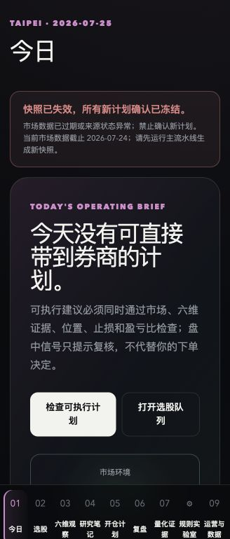
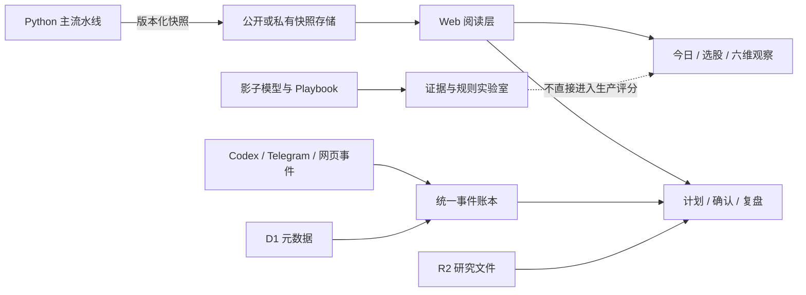

# Axe Bobby · 可审计量化投研工作台

## 我的角色

- 架构分层（研究分 / 入场条件 / 风险边界 / 事件账本）和产品原则由我决定
- 验证标准（快照过期冻结确认、影子模型不自动晋级、固定 seed 可重放）由我制定
- Codex 负责加速实现；所有边界和取舍的最终判断在我

我做 Axe Bobby，是因为自己的研究越来越不像一张选股表：一边是报告、财报、新闻和聊天里不断出现的新线索，另一边是市场风险、入场位置、止损和复盘。真正困难的不是再算一个分数，而是把这些东西放在同一条可以回看的判断链上。

这个仓库现在公开的是 **Axe Bobby Web 工作台**，不是早期的 Python 规则摘录。它读取 Python 主流水线生成的版本化快照，给研究者一个每天可以打开、检查、记录和复盘的界面。公开副本使用脱敏快照；市场数据已经标记为过期，因此本地演示只能查看，不能确认新的开仓计划。



这张图来自当前 Web 工作台的真实首页：它把“快照已经失效，所以不能确认新的计划”直接放在页面上。`public/og.png` 是仓库分享卡片；`public/workbench-home.png` 才是可操作工作台的页面截图。

## 我真正想解决的事

投研工具很容易变成两种极端：要么只有研究笔记，最后无法落到行动；要么只有一个看起来精确的信号，却说不清数据从哪里来、什么时候失效、为什么现在可以执行。

我想做的是中间那一层：把研究证据、市场状态、入场条件和风险边界串起来，但把最后的确认留给人。系统可以帮我减少重复检查，不能替我承担判断。

这也决定了几个产品原则：

- **研究分回答“值得研究什么”，入场分回答“什么时候复核”。** 公司基本面、行业位置和短期价格行为不能混成一个神秘总分。
- **缺数据不是 50 分。** 来源、截止日期、单位和适用性都要能回查；过期快照冻结新的确认。
- **模型可以建议，不能悄悄升级。** 权重预览、影子模型和主题 Playbook 都保留在实验或审计层，不能因为页面上出现了一个数字就进入正式评分。
- **提醒不是下单。** Agent、网页和 Telegram 共用建议 ID 与状态，但任何一个入口都不会自动下单。
- **结果要留下原因。** 确认、否决、复盘、研究笔记和附件最终都应该绑定到快照、模型版本和证据，而不是只留下“当时觉得可以”。

我也愿意把它公开，是因为这类工具不应该只给一个人制造信息差。即使它是我一个人借助工具做出来的，我仍然希望同学能看懂它、拿去改、指出它哪里不可靠。对我来说，技术的价值不只在于形成比较优势，也在于把一个原本零散、难以复核的流程整理出来，让更多人可以少走一点弯路。

## 现在这个工作台有什么

左侧九个入口对应一条实际工作流：

| 入口 | 解决的问题 | 当前实现 |
| --- | --- | --- |
| 今日 | 今天先看什么 | 市场状态、数据新鲜度、优先复核队列和下一步动作 |
| 选股 | 哪些标的值得继续看 | 六维研究分、位置分、行业基准和数据阻断 |
| 六维观察 | 分数到底由什么组成 | 基本面、行业、定价、宏观、估值、催化逐项展开，显示原始证据和截止日 |
| 研究笔记 | 临时观点如何变成可检索记录 | 按标的、方向、角度和置信度保存洞察，并允许修正分类 |
| 开仓计划 | 进入执行前还缺什么 | 复核区间、证伪价、目标、盈亏比、试仓上限和盘中信号 |
| 复盘 | 当时为什么做这个决定 | 证据、纪律、下一次检查和经验记录 |
| 量化证据 | 一个结果到底成熟到哪一步 | 样本、指标、证据等级、限制条件和数据源状态 |
| 规则实验室 | 想改规则时怎么留下痕迹 | 权重预览、影子模型、主题研究 Playbook 和晋级闸门 |
| 运营与数据 | 多个入口如何不各说各话 | Codex、Telegram、网页共用事件账本；事实、证据、决策、事件、文件分层 |

几个页面截图和交互演示会随着仓库继续更新；当前可以先看 `public/demos/` 下的两个脱敏 HTML 版本。它们是早期交互原型，和工作台的生产页面不是同一个模型，也不连接行情或券商。

## 它是怎样一步步变成现在的

这不是一次把所有功能写完的项目，而是边用边收紧边界：

1. **先有六维研究评分。** 我需要把基本面、行业、定价、宏观、估值和催化拆开，避免只凭一个综合分讲故事。
2. **再把研究、入场和风险分层。** 研究分解决“看什么”，Logic Stack 解决“是否出现入场理由”，风险层解决“即使看对了，错了要亏多少”。
3. **再把 Agent 接进来。** 线索可能来自 Codex、Telegram 或网页输入，所以它们需要写入同一套事件契约，而不是各自生成一份孤立提醒。
4. **再做成可操作的 Web 工作台。** 看快照、写笔记、存计划、做确认和复盘成为同一个界面；数据库记录按登录用户隔离。
5. **最近补的是证据和失败状态。** 量化结果有成熟度等级，主题研究先以可证伪 Playbook 存在，统计模型先做样本外影子验证；市场快照过期时，页面明确冻结确认。

这个顺序很重要：我不希望先做一个漂亮的 Dashboard，再想办法解释它为什么值得信任。每增加一块界面，都要回答它使用什么输入、由谁确认、失效时怎么办。

## 架构



Web 层使用 Next.js/React/TypeScript，通过 Vinext 适配 Cloudflare Worker；Drizzle 管理 D1 数据，研究附件的对象存储接口预留给 R2。公开 `workspace-data.json` 只承载展示快照，用户自己的事件、笔记、复盘和文件通过登录后的 owner-scoped API 读取。

Web 不是行情抓取器，也不是 Python 流水线的第二个真相源。“重新加载快照”只重新读取版本化文件；快照生成、数据来源和评分计算仍属于主流水线。这个分层让页面可以复盘某一天的判断，也避免点击网页按钮时偷偷改变正式模型。

## 未来路线

我会按“先提高判断质量，再扩大自动化范围”的顺序迭代：

| 阶段 | 计划 | 验收标准 |
| --- | --- | --- |
| 已完成 | 工作台、六维证据、计划闸门、研究笔记、统一事件账本 | 一个快照能从今日走到观察、计划和复盘；每一步说明数据和边界 |
| 下一步 | 将快照、模型版本和决定记录做更严格的端到端绑定 | 任意一条确认都能回到同一份数据截止日和规则版本 |
| 下一步 | 增加更完整的滚动样本外验证和成本/换手报告 | 影子模型在多个时间窗口都能报告结果，且没有自动晋级路径 |
| 随后 | 把主题 Playbook 的观察、确认和反证做成可追加的研究链 | 行业叙事只有在公司收入、产品交付和利润归属得到证据后才推进 |
| 更后面 | 再评估部署、多人使用和更强的 Agent 编排 | 先通过租户隔离、失败恢复和审计测试，再扩大权限 |

这里没有写具体发布日期，因为这些部分还没有通过验证。尤其是量化结果、模型样本外稳定性和多人部署，不能用页面完成度代替证据。

## 本地运行

[](https://github.com/Praymo/axe-bobby-research-workbench/actions/workflows/ci.yml)

需要 Node.js 22.13+。公开副本不包含真实 API key、数据库、聊天原文、持仓或本机路径；没有绑定 D1/R2 时，页面仍可以读取脱敏快照并展示未登录状态。

```sh
npm install
npm run dev
```

验证：

```sh
npm run lint
npm test
```

`npm test` 会构建应用，并检查页面能否服务端渲染、快照边界、演示文件和 owner-scoped 查询。快照里的市场日期是历史演示数据，页面会显示过期状态；这正是工作台在数据不可靠时应有的行为。

## 边界与许可

这是研究与决策记录工具，不是投资建议、交易执行系统或收益承诺。研究快照中的数字只用于展示系统如何保留来源、样本和限制；公开版本没有接入券商，也不会自动下单。

代码使用 MIT License。研究资料和数据各自遵循原始来源的许可与使用条件。
